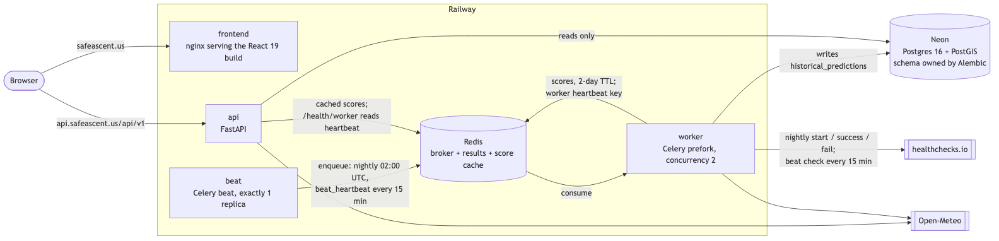

# Deployment

**Stack:** Railway (hosting, one Redis) + Neon (Postgres 16 + PostGIS) + Porkbun (DNS) + healthchecks.io (alerts).

Production is Railway only. `docker-compose.yml` is for local development and mirrors the Railway services (same images and start commands); CI's `guards` job fails if the two drift.

## Services

One repo; each Railway service builds from its own root directory and config file.

| Role | Railway service | Config | Start command | Notes |
|---|---|---|---|---|
| API | `backend` | `backend/railway.toml` | `uvicorn app.main:app --host 0.0.0.0 --port 8000` (Dockerfile default) | Healthcheck `/health`. Worker liveness is `/health/worker`, deliberately not the Railway healthcheck, so a worker outage doesn't take the API down |
| Worker | `celery-worker` | `backend/railway-worker.toml` | `celery -A app.celery_app worker --loglevel=info --concurrency=2 -E` | One replica. Runs the nightly job and the beat heartbeat task |
| Beat | `beat` (**owner creates it**) | `backend/railway-beat.toml` | `celery -A app.celery_app beat --loglevel=info --schedule=/tmp/celerybeat-schedule` | Exactly one replica; a second double-schedules every task |
| Frontend | `frontend` | `frontend/railway.toml` | nginx serving the Vite build | Healthcheck `/health`. `MAINTENANCE_MODE` build arg, see below |
| Redis | Railway Redis | — | — | Celery broker, result backend, and score cache |

The API, worker, and beat all build from `backend/Dockerfile` (Python 3.12, uv, non-root). The frontend builds from `frontend/Dockerfile` (Node 22 build, nginx serve).

Domains: `safeascent.us` (frontend), `www.safeascent.us` (301 to the apex), `api.safeascent.us` (API). TLS is Railway's automatic certificates.

**The worker change and the beat service ship together.** The worker no longer runs an embedded beat. If the new worker deploys without a running `beat` service, nothing schedules the nightly job or the heartbeat.

Worker notes for the relaunch:
- `--concurrency=2` (owner decision): the ~2h nightly run holds one slot and `beat_heartbeat` needs the other. The nightly Redis lock (`SET NX`, 6h TTL) keeps two nightly runs from overlapping. Check the worker's memory with two prefork slots against the Railway plan's memory limit.
- `SKIP_WEATHER_STATISTICS` must be off (unset or `false`) on the worker at relaunch (owner decision).
- The stale-lock recovery counts active nightly runs with `inspect().active()`, which assumes a single worker replica (`numReplicas = 1`).

## Environment variables

`.env.example` is the full list, kept in parity with `app.config.Settings` plus the frontend build args (`tests/test_env_example_parity.py`). Production specifics:

- `DATABASE_URL` on `backend`, `celery-worker`, and `beat`. The target is the least-privilege `app` role. Until the relaunch gate the services still use the owner role; switching them is the first relaunch step (plan Task 26).
- `REDIS_URL` (or the per-purpose `CACHE_REDIS_URL` / `CELERY_BROKER_URL` / `CELERY_RESULT_BACKEND`, which fall back to it).
- `ENVIRONMENT` unset or `production`. `ENABLE_ADMIN_ROUTES` off except for a deliberate admin session. `CORS_ORIGINS` unset (defaults to the production origins).
- `HEALTHCHECKS_NIGHTLY_URL` and `HEALTHCHECKS_BEAT_URL` on the worker (both tasks run there). An unset URL skips the ping with a WARNING.
- Frontend build args: `VITE_API_BASE_URL` (the API's `/api/v1` URL), `VITE_MAPBOX_TOKEN` (public token), `MAINTENANCE_MODE`.
- `MIGRATOR_DATABASE_URL` is set on **no** service. It lives only in the owner's gitignored `backend/.env.migrator`, for the explicit migration step.

## Database, roles, and migrations

- Alembic owns the schema (`backend/alembic/`). Revisions: `0001_baseline` (replays a sanitized schema-only dump; prod was **stamped** at it, never upgraded through it), `0002_drop_ascents_climbers`, `0003_hist_insufficient_data`, `0004_phase2a_foundation`. Treat every revision as forward-only.
- Every migration is an explicit owner step with `MIGRATOR_DATABASE_URL`, never at app startup and never from a Railway pre-deploy hook:
  1. Rehearse on a Neon branch: `uv run alembic upgrade head`, then `uv run alembic check`, from `backend/` with `MIGRATOR_DATABASE_URL` pointing at the branch.
  2. Apply to prod the same way from the owner's machine.
- Roles are created **only** with SQL run as the owner: `backend/db/roles/create_roles.sql`, then `backend/db/roles/verify_roles.sql` (prints `ALL ROLE CHECKS PASSED`). Never with neonctl, the Neon Console, or the Neon API; those grant `neon_superuser`.
  - `migrator` owns the schema objects and is the only app-side role with DDL rights. The owner role keeps DDL for the stamp and role steps, and inherits `migrator` (`WITH SET TRUE, INHERIT TRUE`) until the relaunch gate revokes that membership.
  - `app` has `SELECT` on the tables and writes only `historical_predictions` (the nightly upsert and purge).
  - `analyst` is pre-existing and read-only: `SELECT` via default privileges, no DML or DDL. It must already exist before `create_roles.sql` runs (the script grants it default privileges and `verify_roles.sql` checks it).
  - Role passwords are generated into the gitignored 0600 env files (from `backend/`: `python -m scripts.write_role_url --role <r> --env-file .env.<r> --generate-password`). `create_roles.sql` reads them as plaintext from `MIGRATOR_PASSWORD`/`APP_PASSWORD` via psql `\getenv` (never argv) and sends them over `verify-full` TLS; the server stores SCRAM-SHA-256. Neon rejects pre-hashed verifiers ("Neon only supports being given plaintext passwords", 2026-09-28), so the script refuses a value that looks like a SCRAM or md5 verifier, and anything under 32 characters.
  - `create_roles.sql` also revokes the running owner's default table grants to `analyst` in `public` (prod's `neondb_owner` had one). After `alembic stamp` and `alembic upgrade head`, `REVOKE ALL ON public.alembic_version FROM app`: the stamp creates that table under `migrator`'s default `SELECT` grant to `app`.
  - Role URLs (`migrator`, `app`) connect with full certificate and hostname verification (asyncpg `ssl=verify-full`), not just encryption: `app/db/ssl.py` builds the SSLContext from certifi's CA bundle (the `python:3.12-slim` image has no `ca-certificates` package, and asyncpg's own verify-full has no OS-trust fallback), applied only for a non-local host so `docker-compose.yml`'s TLS-less local/CI Postgres is unaffected.
- The step-by-step role and stamp procedure, including how credentials are generated and kept out of terminals and chat, is the owner runbook in `docs/superpowers/plans/2026-09-27-phase1b-foundations-pr5-8.md` (Task 8; relaunch steps in Task 26). This file does not repeat it.
- Phase 2 roles and schema: `create_roles_phase2.sql` (owner, once), migrations as `migrator`, then `grants_phase2.sql` and `verify_roles_phase2.sql` after each Phase 2 migration. Runbook: `docs/superpowers/plans/2026-09-28-phase2a-foundations.md` Tasks 8–10. Owner/analyst `psql` URLs always use `sslmode=verify-full&sslrootcert=system`.
- **Migrate before deploy** (owner decision 2026-09-29). Apply a migration to prod before any deploy of code that depends on it. `0004_phase2a_foundation`: the `Accident` model maps its 21 new columns and `/predict` selects them, so a deploy of the Phase 2a foundations merge before `0004` is on prod breaks `/predict` with `UndefinedColumnError`. **Before merging that PR**, confirm auto-deploy is off on every Railway service, and pause it if it is on: with auto-deploy on, the merge itself deploys. Deploys of `main` then stay off until the runbook's Task 9 Step 4 has succeeded (pre-merge gate at the top of Task 8). The old code ignores the added columns, so migrating first is always safe.
- Known limitation, MP tick-aggregate reloads (open for the owner): `internal.mp_tick_aggregates` is INSERT-only and MP's totals only grow, so a later scrape's totals mostly come back `count_changed`, roughly 8–12% of the batch, above the loader's default `--max-quarantine-share 0.10`. A later-scrape reload is therefore likely rejected whole, and its newly closed months do not land. The first load is unaffected. Needs a decision (exclude `total` rows from the share, or key totals per scrape) before the second load.

## Nightly job

At 02:00 UTC, beat enqueues `compute_daily_safety_scores_optimized` (message expires after 8h). The worker:

- takes the population lock, then computes today plus the next 2 days;
- writes Redis score keys (2-day TTL) and `historical_predictions` rows (a route with too little evidence is stored as `risk_score` NULL + `gray`);
- purges `historical_predictions` rows older than a year;
- pings `HEALTHCHECKS_NIGHTLY_URL` with `/start`, then success or `/fail` (the error is re-raised). A run skipped by the lock sends no pings.

Time limits: soft 5h, hard 5.5h, below the 6h lock TTL and broker visibility timeout, so a hung run is killed before a redelivered copy could start a duplicate.

Operator notes:

- A lost broker connection cancels the in-flight nightly (`worker_cancel_long_running_tasks_on_connection_loss`). With the Redis broker the unacked message comes back only after the 6h `visibility_timeout`, so a run cancelled soon after 02:00 reruns around 08:00 UTC, and not at all if redelivery lands after the message's 8h `expires` (it is then discarded and counted as expired). The cancelled child may skip its `finally` lock release; the stale-lock recovery then applies, and it fails closed (keeps the lock) when `inspect()` does not answer.
- `GET /api/v1/mp-routes/admin/trigger-cache-population` runs the same task, which pings `HEALTHCHECKS_NIGHTLY_URL` on success like the scheduled run. A manual run therefore resets the nightly check and can mask a missed scheduled run for up to a day.
- Beat keeps its schedule state in `/tmp/celerybeat-schedule`, which is lost when the beat container restarts. A beat restart that straddles 02:00 UTC skips that night's run (a fresh beat does not catch up a missed crontab slot); the `safeascent-nightly` healthchecks alert catches it.

Revoked and expired tasks are logged at ERROR; expired ones are counted per task per UTC day. `GET /health/worker` reports the 7-day counts.

## Alerts and liveness

| Check | Pinged by | Period | Grace |
|---|---|---|---|
| `safeascent-nightly` | the nightly job (start, success, fail) | 24h | 4h |
| `safeascent-beat` | `beat_heartbeat`, scheduled by beat every 15 min and run on the worker | 15 min | 60 min |

The beat check proves both that beat scheduled the task and that the worker consumed it, so a dead consumer alerts within 75 minutes.

`GET /health/worker` returns 200 while the worker's Redis heartbeat is fresh (`WORKER_HEARTBEAT_TTL_SECONDS`, default 120s) and 503 when it is missing or Redis is unreachable. Caveat: the heartbeat proves the consumer loop is turning only under the prefork pool on the Redis broker, which is what the worker runs. With `-P gevent`/`eventlet`, or when the consume socket dies silently, the heartbeat can stay fresh; the `safeascent-beat` healthchecks.io check is what catches those.

## Maintenance mode

The frontend image takes a `MAINTENANCE_MODE` build arg (Railway service variable on `frontend`).

- `MAINTENANCE_MODE=true`: every path returns `503` with `Retry-After: 3600` and `Cache-Control: no-store`, serving `frontend/maintenance/index.html`. `/health` still returns `200` for the Railway healthcheck.
- `MAINTENANCE_MODE=false` (default): the React app.
- Both modes redirect `www.safeascent.us` to `https://safeascent.us` with a 301.

To flip: set the variable on the `frontend` service and redeploy. Locally: `frontend/docker-tests/test_images.sh all` checks both modes.

## Deploy pipeline

- CI (`.github/workflows/ci.yml`) runs on every PR and every push to `main`. Jobs: `backend` (uv sync, ruff, mypy, pip-audit, pytest including the migration and role tests against a PostGIS service, image build), `frontend` (npm ci, lint, typecheck, npm audit, vitest, build, image tests), `guards` (`scripts/check_no_scrapers.py`, a check that `docker compose config --services` matches the Railway topology, and `scripts/check_compose_matches_railway.py` for the worker/beat start commands) and `ci-ok`.
- `ci-ok` is the one required check. It fails unless every other job succeeded. Keep its name stable, because Railway "Wait for CI" and branch protection both key on it.
- Railway builds its own images from GitHub `main`. "Wait for CI" (after owner setup — not yet enabled) will make a red commit on `main` never deploy. No image registry and no deploy token are involved.
- **Auto-deploy is OFF on every Railway service until the relaunch** (plan Task 26); until then every deploy is a manual owner action. Re-enable it only after all three hold: migration `0003` is applied to prod, the `beat` service exists, and "Wait for CI" is on.
- `main` branch protection (a PR and a green `ci-ok` required, admins included, force-pushes blocked) is after owner setup — not yet enabled.
- Scraper code (anything fetching and parsing HTML pages) is never committed (D9). The `guards` job enforces this.

## Insufficient-data rollout (2026-09-28)

1. Run `alembic upgrade head` (migration `0003_hist_insufficient_data`) before the new backend/worker code runs. Without it the nightly history insert hits `risk_score NOT NULL` for any batch containing an insufficient route, and the task now fails on that.
2. Deploy backend and frontend together (the frontend requires `data_status`).
3. Right after the deploy, trigger the nightly population task (`compute_daily_safety_scores_optimized`) once, e.g. via `GET /api/v1/mp-routes/admin/trigger-cache-population` (only mounted when `ENABLE_ADMIN_ROUTES` is set) or by calling the Celery task from a worker shell. Redis still holds scores from before the deploy; reads already map a stale `0.0` to insufficient, but a fresh run rewrites every route under the new rule.
